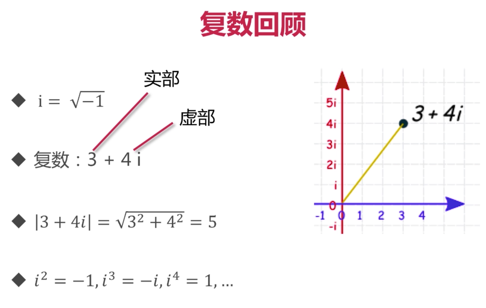
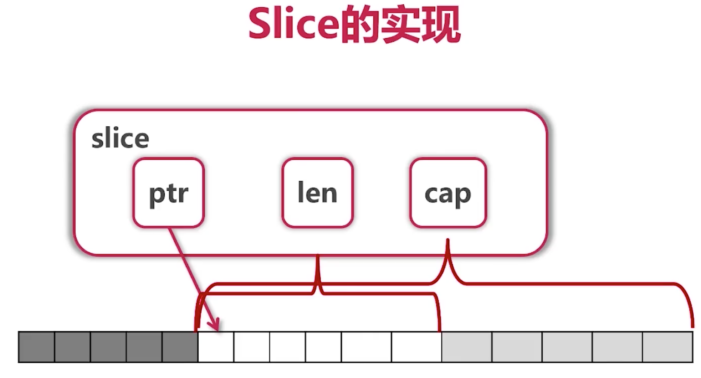

# GO

## 备注

1. 字符串或者引入的包名, 都需要用 **双引号** .
2. 可以通过 **_** 省略变量.

## 包

> GO语言内置API, 各种工具库.

### fmt

> 各种打印输出.

### strings

> 字符串相关方法.

- Fields
- Split
- Join
- Contains
- Index
- ToLower
- ToUpper
- Trim
- TrimRight
- TrimLeft

### utf8

> 一般处理中文会用到.

## 变量

###声明变量

> var 变量名 变量类型 = 值

```go
package main

import "fmt" // 引入包, 用来打印

// Printf 可以打印空字符串
// 变量所在函数名可以自己定义
// 变量类型可以省略
// 同一行可以声明多个变量, 如果不规定变量类型, 甚至可以同时声明多个不同种类的变量
// 可以用 := 来代替 var 加 = 来声明变量, 但是不能用于赋值, 参考下面的 short()

func variableZeroValue() { // 定义空值的变量
    var a int
    var s string
    fmt.Printf("%d %q\n", a, s)
}

// Println 打印

func variableInitialValue() { // 定义有初始值的变量
    var a, b int = 3, 4
    var s string = "字符串"
    fmt.Println(a, s, b)
}

func _myvariable() {
	var a, b = 1, true
	fmt.Println(a, b)
}

func short() {
	a, b, c := 2, true, "hehe"
	fmt.Println(a, b, c)
}

func main() {
    variableZeroValue()
	variableInitialValue()
    _myvariable()
    short()
}

```

上面的变量都是定义在函数内部的, 作用域也只在函数内部生效.

可以直接在文件中声明变量, 单个 go文件, 是一个包, 文件中声明的变量, 作用域存在于这个包中.

```go
package main

import "fmt"

// 声明包变量的时候, 不能使用 := 这种简写形式

var aa = "12"

// 下面这种声明方式, 可以省略很多 var

var (
	ss = "ss"
	bb = "bb"
)

func main() {
	fmt.Println(aa, ss, bb)
}

```


### 内建变量类型

####布尔值

- bool

#### 字符串

- string

#### 整数类型

- int
- (u)int
- (u)int8
- (u)int16
- (u)int32
- (u)int64
- (u)uintptr

> 不加 (u) 直接用 int 就是有符号整数(负数).
>
> 用了 (u) 是无符号整数, 声明时可以携带长度.
>
> (u)int 的长度跟着操作系统走.
>
> (u)uintptr 指针, 长度跟着操作系统走.

#### 字节型

- byte

#### 字符型

- rune

#### 浮点数

- float32
- float64
- complex64
- complex128

> complex 复数



#### 强制类型转换

go语言不支持隐式类型转换, 全部需要手动强制转换.

```go
package main

import (
	"math"
	"fmt"
)

func triangle() {
	var a, b int = 3, 4
	var c int
	// math.Sqrt 需求的是浮点数, 但是我们传入的是整形, 所以会报错
	//c = math.Sqrt(a * a + b * b)
	// 下面这样才可以
	c = int(math.Sqrt(float64(a * a + b * b)))
	fmt.Println(c)
}

func main() {
	triangle()
}
```

## 常量

> 常量可变量声明大致相同.
>
> 可以声明类型, 也可以不声明类型.
>
> 可以在包内部或者在函数总声明, 有个字的作用域.
>
> 可以用 () 来一起声明, 只需要写一个const.
>
> go语言中, 常量什么不建议直接用大写, go语言中 **大小写** 是有含义的.

```go
package main

import "fmt"

func consts() {
	const (
		filename string = "abc.text"
	 	a, b = 3, 4
	)
	var c int
	c = int(a * a + b)
	fmt.Println(filename, c)
}

func main() {
	consts()
}
```

### 枚举类型的常量

> 枚举类型没有特殊的关键字.
>
> 通过 const 块来定义, 通过 iota 自增.

####iota

iota 用来定义自增值

```go
package main

import "fmt"

func enums() {
	// iota 代表自增值, 从 0 开始
	const (
		c = iota
		java
		python
		golang
	)
	fmt.Println(c, java, python, golang)
	// 打印结果 0 1 2 3
	fmt.Println(golang, c)
	// 打印结果 3 0
}

func main() {
	enums()
}
```

iota 可以参与运算

```go
package main

import "fmt"

func enums() {
	const (
		b = 1 << (10 * iota)
		kb
		mb
		gb
		tb
		pb
	)

	fmt.Println(b, kb, mb, gb, tb, pb)
	// 打印结果 1 1024 1048576 1073741824 1099511627776 1125899906842624
}

func add() {
	const (
		b = 2 * iota + iota
		kb
		mb
		gb
		tb
		pb
	)

	fmt.Println(b, kb, mb, gb, tb, pb)
	// 打印结果 0 3 6 9 12 15
}

func main() {
	enums()
    add()
}
```

##条件语句

### if else

> 在 if 语句中, 可以在条件语句中直接声明变量, 这个变量只存在于这一块 if 语句块中.
>
> if 条件语句中声明的变量可以与外部变量重名, 这样, if语句块中的相同变量名都会基于 条件语句中的变量名做出改变, 而非, 外部的相同变量名.

基本写法

```go
package main

import "fmt"

func fn(v int) int {
	if v < 0 {
		return 0
	} else if v > 100 {
		return 100
	} else {
		return v
	}
}

func main() {
	var a = fn(-2) // 0
	var b = fn(101) // 100
	var c = fn(22) // 22
	fmt.Println(a, b, c)
}
```

#### 特点

- if else 不需要小括号
- 可以同时 return 多个返回值
- if 的条件中可以直接赋值, 这种情况下, 变量的作用域只存在于 if 语句块中

####读取文件案例

```go
package main

import (
	"io/ioutil"
	"fmt"
)

func main() {
	const filename = "abc.txt"
	contents, err := ioutil.ReadFile(filename)
	if err != nil { // 当读取文件出错时, 打印
		fmt.Println(err) // open abc.txt: no such file or directory, 没有读取文件,所以打印这句话
	} else { // 读取文件成功时
		fmt.Printf("%s\n", contents)
	}
    
    // 上面的代码可以简写成下面的形式
    // 这种情况下, contents 和 err 的作用域只存在于 if 语句块中.
    if contents, err := ioutil.ReadFile(filename); err != nil {
		fmt.Println(err)
	} else {
		fmt.Printf("%s\n", contents)
	}
}
```

### switch case

> switch 语句中, 由上至下至下, 只要碰到第一个 case 满足条件, 会自动忽略后续的 case.
>
> `default` 存在的情况下, 当前面的case均不满足条件时, 会触发.
>
> switch 后面可以直接声明变量当做初始条件, 同 if 语句一样, 用 `;` 分割.

```go
list := [...]string{"A", "B"}
switch name := list[0]; name {
    // code
}
```

基本写法

```go
package main

import "fmt"

func fns(a, b int, op string) int {
	var result int
	switch op {
	case "+":
		result = a + b
	case "-":
		result = a - b
	case "*":
		result = a * b
	case "/":
		result = a / b
	default:
		panic("error:" + op) // 手动触发报错, 并且停止程序
	}
	return result
}

func main() {
	var s = fns(2, 3, "+")
	fmt.Println(s) // 5
}
```

#### 特点

- go语言的switch会自动break, 除非用fallthrough

```go
package main

import "fmt"

func fns(score int) string {
	g := ""
	switch {
	case score < 0 || score > 100:
		panic("error")
	case score < 60:
		g = "F"
	case score < 80:
		g = "C"
	case score <= 100:
		g = "A"
	}
	return g
}

func main() {
	var s = fns(2)
	fmt.Println(s) // F
}
```

## 循环

### for

> for 语句代表着循环. 一条语句通常由关键字 for, 初始化子句, 条件表达式, 后置子句和花括号包裹的代码块组成. 其中, 初始化子句, 条件表达式和后置子句之间需要用分号分隔. 
>
> 可以省略掉初始化子句, 条件表达式, 后置子句中的任何一个或多个, 不过起到分割作用的分号一般需要被保留下来, 除非在仅有条件表达式或三者全被省略时分号才可以被一同省略.
>
> 可以用 `range` 替换掉for子句, 可迭代类型基本都可以用 `range` , 例如: 字符串, 数组, 数组的指针, 切片, 字典, 通道.
>
> 携带 `range` 子句的 `for` 语句还可以应用于一个通道值之上. 其作用是不断地从该通道值中接收数据, 不过每次只会接收一个值. 注意, 如果通道值中没有数据, 那么 `for` 语句的执行会处于阻塞状态. 无论怎样, 这样的循环会一直进行下去. 直至该通道值被关闭, `for` 语句的执行才会结束.
>
> 和**javascript**一样, `for` 循环可以被 `break` 与 `continue` 打断, 前者立即结束循环, 后者, 直接执行下一次迭代.

基本写法

```go
for i := 1; i <= 10; i++ {
   if n := i % 2; n != 0 {
      fmt.Println(i) // 打印奇数
   }
}
// range
for i, v := range "GO语言" {
    fmt.Println(i, v)
}
```

#### 特点

- 条件不用括号
- 可以省略初始条件,结束条件,递增表达式

### 整数转二进制

```go
package main

import (
	"fmt"
	"strconv"
)

func fn(n int) string {
	result := ""
	for ; n > 0; n /= 2 {
		lsb := n % 2
		result = strconv.Itoa(lsb) + result
	}
	return result
}

func main() {
	fmt.Println(
		fn(5), // 101
		fn(13), // 1101
	)
}
```

## 函数

> 在GO语言中, 函数式一等类型(first-class). 这意味着, 我们可以把函数作为值来传递和使用. GO语言的函数可以一次性返回多个结果.

基本写法

```go
func fn(a, b int, op string) int {
    // code
}
```

### 特点

- 一个函数可以同时返回多个返回值

### 例子

#### 同时返回多个返回值

> 使用场景: 第二个返回值常用于返回错误信息

```go
// 第一个括号,设置输入值, 第二个括号, 设置返回值类型, return 的时候, 用 , 分隔多个返回值
func fn(a, b int) (int, int) {
	return a / b, a % b
}
fmt.Println(fn(11, 2))
// 可以直接在第二个括号里设置返回值的名字和类型, 如此操作, 在调用的时候,可以同时给多个变量赋值
// 当有多个返回值存在时, 只想获得某一个返回值, 可以在不需要的返回值对应的位置, 用 _ 来接受
func fn2(a, b int) (q, r int) {
	return a / b, a % b
}
x, y := fn2(23,2)
fmt.Println(x, y)
```

#### 将函数当做参数

```go
package main

import (
	"fmt"
	"reflect"
	"runtime"
)

func fn(op func(int, int) int, a, b int) int {
	p := reflect.ValueOf(op).Pointer() // 寻找这个函数的指针
	opName := runtime.FuncForPC(p).Name() // 获取函数名
	fmt.Printf("Calling function %s with args " + "(%d, %d)", opName, a, b)
	return op(a, b)
}

func main() {
	result := fn(
		func(a, b int) int { // 由于是匿名函数,函数名为 func1
			return a + b
		}, 3, 4)
	fmt.Println(result)
}
```

#### 可变参数列表

```go
package main

import "fmt"

func fn(numbers ...int) int {
	s := 0
	for i := range numbers {
		s += numbers[i]
	}
	return s
}

func main() {
	fmt.Println(fn(1,2,3,4,5)) // 15
}
```

## 指针

> 指针操作涉及到两个操作符 `&` 和 `*` . 这两个操作符均有多个用途. 但是当它们作为地址操作符出现的时候, `&` 的作用是取地址, `*` 的作用是取值. 更通俗地讲, 当地址操作符 `&` 被应用到一个值上时会取出指向该值的指针, 而当地址操作符 `*` 被应用到一个指针值上时会取出该指针指向的那个值. 它们可以被视为相反的操作.
>
> 当 `*` 出现在一个类型之前 `*Person` `*[3]string` , 此时, 不能被看做是操作符, 而应该被视为一个符号. 如此组合而成的标识符所表达的含义是作为第二部分的那个类型的指针类型. 我们也可以把其中的第二部分所代表的类型被称为基底类型. 例如: `*[3]string` 是数组类型 `[3]String` 的指针类型, 而 `[3]string` 是 `[3]string` 的基底类型. 

基本写法

```go
a := 2
fmt.Println(a) // 2
var pa *int = &a // pa 是一个对 a 的指针, 指针用 *int 进行表示, & 来指定某个变量
*pa = 10
fmt.Println(a) // 10
a = 3
fmt.Println(a) // 3
```

### 特点

- 指针不能运算

### 案例

#### 值传参 和 指针传参

```go
package main

import "fmt"

func fn(a, b int) { // 值传参
	a, b = b, a
}

func swap(a, b *int) { // 指针类型传参
	*b, *a = *a, *b
}

func main() {
	a, b := 1, 5
	fn(a, b) // 传入值, 不会影响初始变量
	fmt.Println(a, b) // 1, 5
	swap(&a, &b) // 传入指针, 会影响初始变量
	fmt.Println(a, b) // 5, 1
}
```

## 数组

基本写法

> var 数组名 [数组长度] 数组类型

```go
package main

import "fmt"

func main() {
	var arr [5]int // 默认值都是 0 , 即 5 个 0
	arr2 := [3]int{1, 3, 5} // := 写法的话,需要给初始值
	arr3 := [...]int{2, 4, 6, 8} // 可以用 ... 来代替数组长度
	fmt.Println(arr, arr2, arr3)
}
```

### 特点

- 数量写在类型前
- 可通过 _ 省略变量
- 如果只想获取 **i** , 可以写成 `for i := range numbers`
- 长度不同的数组, go语言会认为他们是不同的数据类型
- 函数调用数组时, 会拷贝数组
- go语言一般不直接使用数组, 用切片

### 切片 (Slice)

基本操作

```go
// 含头不含尾
arr := [...]int{0,1,2,3,4,5}
fmt.Println(arr[:6]) // [0 1 2 3 4 5]
fmt.Println(arr[0:]) // [0 1 2 3 4 5]
fmt.Println(arr[:]) // [0 1 2 3 4 5]
fmt.Println(arr[2:3]) // [2]
fmt.Println(arr[1:3]) // [1 2]
```

> slice 是对 arr 的一个 view(视图).

```go
func update(s []int) {
	s[0] = 100
}

func main() {
	arr := [...]int{0,1,2,3,4,5}
	update(arr[:]) // 将视图作为参数传入, 会改变原始数组, 不理解
	fmt.Println(arr[:]) // [100 1 2 3 4 5]
	fmt.Println(arr) // [100 1 2 3 4 5]
}
```

> slice 可以建立 slice.
>
> 新的slice是基于旧slice建立的,而非原始数组.

```go
arr := [...]int{0,1,2,3,4,5}
s1 := arr[2:]
fmt.Println(s1) // [2 3 4 5]
s1 = s1[0:2]
fmt.Println(s1) // [2 3]
```

> slice可以扩展

```go
arr := [...]int{0, 1, 2, 3, 4, 5, 6, 7}
s1 := arr[2:6] // [2 3 4 5]
// 当slice超过基准对象的长度,会从原始数组继续取值, 若超过原始数组长度, 则会报错
// 如果直接用 s1[4] 和 s1[5] 是取不到的
s2 := s1[3:6] // [5 6 7]
fmt.Println(s1,s2)
```

#### slice的常用操作(创建,拷贝,截取)

```go
package main

import "fmt"

func printSlice(s []int) {
	fmt.Printf("s=%d, len=%d, cap=%d\n", s, len(s), cap(s))
	// 每次添加元素的时候,cap装不下后,会直接翻倍
}

func main() {
	// 创建 slice
	fmt.Println("创建")
	var s []int // 定义一个 int 的 slice, 默认有一个 zero_value, 这个时候 s == nil
	for i:=0 ; i < 10; i++ {
		//printSlice(s)
		s = append(s, i) // 添加元素
	}
	fmt.Println(s) // [0 1 2 3 4 5 6 7 8 9]

	s1 := []int{2,4,6,8} // 这种操作,首先建立了一个arr,然后,建立了一个slice会view这个arr
	printSlice(s1) // s1 = [2 4 6 8], len=4, cap=4
	s2 := make([]int, 8, 9) // 建立一个len为8,cap为9的slice,所有元素都为0
	printSlice(s2) // s2 = [0 0 0 0 0 0 0 0], len=8, cap=9

	// copy slice
	fmt.Println("拷贝")
	// s1 = [2 4 6 8], len=4, cap=4
	// s2 = [0 0 0 0 0 0 0 0], len=8, cap=9
	copy(s2, s1) // 将后者覆盖前者
	printSlice(s2) // copy后 s2 = [2 4 6 8 0 0 0 0], len=8, cap=9

	// 截取, 没有原生的方法, 需要手动操作
	fmt.Println("截取")
	s2 = append(s2[:4], s2[6:]...)
	// 先截取前四位, [2 4 6 8], 再加上第6和第7个元素 [0, 0], 不传第二个参数, 可以直接截取前几位
	printSlice(s2) // s2 = [2 4 6 8 0 0], len=6, cap=9
}
```

#### 删除开头

```go
package main

import "fmt"

func printSlice(s []int) {
	fmt.Printf("s=%d, len=%d, cap=%d\n", s, len(s), cap(s))
	// 每次添加元素的时候,cap装不下后,会直接翻倍
}

func main() {
	// 删除开头
	s := []int{0,1,2,3}
	printSlice(s) // s = [0 1 2 3], len=4, cap=4
	s = s[2:] // 删除开头前两位
	printSlice(s) // s = [2 3], len=2, cap=2
}
```

#### 删除末尾

```go
package main

import "fmt"

func printSlice(s []int) {
	fmt.Printf("s=%d, len=%d, cap=%d\n", s, len(s), cap(s))
	// 每次添加元素的时候,cap装不下后,会直接翻倍
}

func main() {
	// 删除末尾
	s := []int{0,1,2,3}
	printSlice(s) // s = [0 1 2 3], len=4, cap=4
	s = s[:len(s) - 2] // 删除末尾前两位
	printSlice(s) // s = [0 1], len=2, cap=4
}
```

#### slice的实现



> prt 是从原始数组切割的起点.
>
> len 是切割长度.
>
> cap 是 slice 的起点到 arr 的末尾的集合.
>
> 我们用 s[i] 只能获取 len 以内的值.
>
> 但是基于 slice 的 slice 是可以访问到 cap 中的值的.
>
> slice只能向后扩展,不能向前扩展,不能c

####append添加元素

```go
arr := [...]int{0,1,2,3,4}
fmt.Println(arr) // [0 1 2 3 4]
s := arr[1:3]
fmt.Println(s) // [1 2]
sc := append(s, 10)
fmt.Println(s, sc) // [1 2] [1 2 10]
sf := append(sc, 20)
fmt.Println(arr, sf) // [0 1 2 10 20] [1 2 10 20]
// 在切片上slice的时候,会拷贝一个新的arr,原始数组如果没人用,会被回收掉
// 在新的slice上添加元素后,会改变新的arr

// ==================分割线=======================

arr := [...]int{0,1,2,3,4}
fmt.Println(arr) // [0 1 2 3 4]
s := arr[1:3] // [0 1 2 3 4] [1 2]
fmt.Println(arr, s)
s = append(s, 55)
fmt.Println(arr, s) // [0 1 2 55 4] [1 2 55]
// 直接在切片上append元素时,会影响原始数组

func sliceAppend () {
	arr := [...]int{1,2,3,4,5,6,7,8,9,10}
	s := arr[4:6:8] // [5,6] slice 第三个参数, 限定 cap 的上限
	length := len(s) // 2 含头不含尾
	capacity := cap(s) // 4 声明 slice 的时候, 第三个参数限制了 cap 的长度, 所以, cap 的长度是 第4位到第8位(不包含最后一位, 4,5,6,7 总计是4)
	fmt.Println("slice:", s,"length:", length, "capacity:", capacity)
	// slice: [5 6] length: 2 capacity: 4
	fmt.Println()
	s = s[:4] // [5 6 7 8] capacity为4, 可以拓展至这么多, 如果改成5会报错
	s = append(s, 11, 12, 13)
	// 但是可以通过append方法突破capacity的限制 [5 6 7 8 11 12 13]
	// 原理: 一旦拓展操作超出了被操作的切片值的容量, 那么该切片的底层数组会被自动替换.
	fmt.Println("slice:", s,"length:", len(s), "capacity:", cap(s))
	// slice: [5 6 7 8 11 12 13] length: 7 capacity: 8
	fmt.Println()
	s = append(s, 21, 22, 23, 24, 25)
	fmt.Println("slice:", s,"length:", len(s), "capacity:", cap(s))
	// slice: [5 6 7 8 11 12 13 21 22 23 24 25] length: 12 capacity: 16
	// capacity会自动翻倍拓展
}
```

#### copy复制元素

```go
func sliceCopy () {
	arr := [...]int{1, 2, 3, 4, 5, 6, 7, 8, 9}
	s := arr[:5]
	s2 := []int{0,0,0}
	fmt.Println("s:", s) // s: [1 2 3 4 5]
	fmt.Println("s2:", s2) // s2: [0 0 0]
	copy(s, s2) // 把第二个参数中的元素复制到第一个参数中相应的位置.
	fmt.Println("s:", s) // s: [0 0 0 4 5]
	fmt.Println("s2:", s2) // s2: [0 0 0]
	// 被赋值的元素的个数总等于长度较短的那个参数值的长度.
	// copy方法会直接对第一个参数进行修改.
}
```

### 案例

#### 二维数组

```go
package main

import "fmt"

func main() {
	var arr [2][3]int // 创建一个包含两个长度为3的数组的数组
	fmt.Println(arr)
	// [[0 0 0] [0 0 0]]
}
```

#### 遍历数组

> 用 **range** 关键字.
>
> 或者中普通的for循环, 用 **len** 关键字获取数组长度.

```go
package main

import "fmt"

func main() {
	arr := [...]string{"零", "一", "二"} // 创建数组,会默认建立一个slice切片
	for i, v := range arr {
		fmt.Println(i, v) // 获取下标和值
	}

	for _, v := range arr {
		fmt.Println(v) // 只获取值, 传参时, 用 _ 可以避免获取前面的参数
	}
}

// for循环遍历,不推荐
// for i := 0; i < len(arr); i++ {
//     fmt.Println(arr[i])
// }
```

####值类型传参给函数

```go
package main

import "fmt"

func fn(arr [5]int) { // 值传递,并不会改变外面的数组
	arr[0] = 100
	fmt.Println("inside", arr) // [100 2 3 4 5]
}

func main() {
	arr := [5]int{1,2,3,4,5}
	fn(arr)
	fmt.Println("outside", arr) // [1 2 3 4 5]
}
```

#### 指针传参给函数

```go
package main

import "fmt"

func fn(arr *[5]int) { // 指针传递,会改变外面的数组
	arr[0] = 100
	fmt.Println("inside", arr) // inside &[100 2 3 4 5]
}

func main() {
	arr := [5]int{1,2,3,4,5}
	fn(&arr)
	fmt.Println("outside", arr) // outside [100 2 3 4 5]
}
```

## Map

基本写法

```go
stringMap := map[string]string {
    "name": "ATOM",
    "age": "27",
    "hobby": "sleep",
}
fmt.Println(stringMap) // map[name:ATOM age:27 hobby:sleep]

intMap := make(map[string]int)
fmt.Println(intMap) // map[]
```

### 基本操作

####遍历

> 每次遍历的顺序是不一样的, map 是一个无序列表

```go
m := map[string]string {
    "name": "ATOM",
    "age": "26",
    "hobby": "sleep",
}
fmt.Println(m)
for k, v := range m {
    fmt.Println(k, v)
}
```

#### 获取值

> 如果没有key, 则返回zerovalue

```go
m := map[string]string {
    "name": "ATOM",
    "age": "26",
    "hobby": "sleep",
}
fmt.Println(m)
name := m["name"]
name2 := m["nae"]
fmt.Println(name) // ATOM
fmt.Println(name2) // 如果没有这个 key, 拿到一个空字符串 , int 下就是 0
```

#### 判断是否有这个KEY

```go
m := map[string]string {
    "name": "ATOM",
    "age": "26",
    "hobby": "sleep",
}
fmt.Println(m)
name, k := m["name"] // 传入第二个参数即可, 参数叫什么无所谓
fmt.Println(name, k) // ATOM true
name2, ok := m["name2"]
fmt.Println(name2, ok) // 空值 false

// 常用方法
if name, ok := m["name"]; ok {
    fmt.Println(name)
} else {
    fmt.Println("没有找到 key")
}
```

#### 删除

> delete

```go
m := map[string]string {
    "name": "ATOM",
    "age": "26",
    "hobby": "sleep",
}
fmt.Println(m) // map[name:ATOM age:26 hobby:sleep]
delete(m, "name")
fmt.Println(m) // map[hobby:sleep age:26]
```

### 特点

- 获取值: m[key]
- key不存在时, 获得 value类型的初始值
- 用 value, ok := m[key] 来判断是否存在key
- delete 删除 key
- 遍历用 range, 但是不保证顺序
- 使用 len 来获取 map 长度
- map 使用 哈希表, 必须可以比较相等
- 除了 slice, map, function 的内建类型都可以当key, 因为他们无法判断相等

## chan - 通道类型

> Channel是GO语言中一种非常独特的数据结构. 它可用于不同Goroutine之间传递类型化的数据, 并且是并发安全的. 相比之下, 我们之前介绍的那些数据类型都不是并发安全的. 这一点需要特别注意.
>
> Goroutine(也成为GO程序)可以被看做是承载可被并发执行的代码块的载体. 它们由Go语言的运行时系统调度, 并依托操作系统线程(又称内核线程)来并发地执行其中的代码块.
>
> 与其他的数据类型不同, 我们无法表示一个通道类型的值. 因此, 我们也无法用字面量来为通道类型的变量赋值. 我们只能通过调用内建函数 `make` 来达到目的. `make` 函数可以接受两个参数. 第一个参数代表了将被初始化的值的类型的字面量(这边的情况是 chan int), 第二个参数是长度. 例如, 初始化一个长度为5的元素类型为int的通道, 需要 `make(chan int, 5)` . make函数也可以初始化切片类型与字典类型的值.
>
> 确切的说, 通道值的长度应该被称为其缓存的尺寸. 换句话说, 它代表着通道值中可以暂存的数据的个数. 注意, 暂存在通道值中的数据时先进先出的.

```go
// 缓冲通道
ch := make(chan int, 5)
ch <- 1 // 给通道发送数据
ch <- 2 // 给通道发送数据
s, ok := <- ch // 从通道获取数据
fmt.Println(s) // 1
```

> 通道有带缓冲和非缓冲之分. 缓冲通道可以缓存N个数据. 初始化一个通道值的时候必须指定这个N. 相对的, 非缓冲通道不会缓存任何数据. 发送方在向通道值发送数据的时候回立即被阻塞, 知道某一个接收方已从该通道值中接收了这条数据. 

```go
// 非缓冲通道
ch := make(chan int, 0)
```

```go
// 通道都是双向的, 如要变成单向通道, 需要下面的写法
type Sender chan<- int
// 接收操作符 <- 放在了关键字 chan 的右边.
// 这种就是发送数据的通道.

type Receiver <-chan int
// 这种写法代表了, 一个只可从中接收数据的单向通道类型. 这样的通道也被称为接收通道.
// 关键字 chan 左边的接收操作符 <- 形象地表示出了数据的流向.

var myChannel = make(chan int, 3)
var sender Sender = myChannel
var receiver Receiver = myChannel
```

## struct - 结构体

>类似于 JS 中的 class, 但是, 结构体的方法要写在外面, 在参数中, 用 *(指针)指向该结构体.
>
>结构体不能继承, GO语言也没有继承这个概念.
>
>我们可以通过在结构体类型的声明中添加匿名字段(或称嵌入类型)来模仿继承.

```go
type Person struct {
	Name string
	Gender string
	Age uint8
}

func (p *Person) Grow() {
	p.Age++
}

atom := Person{
    Name: "Atom",
    Gender: "Male",
    Age: 26,
}
atom.Grow()
```

## interface - 接口 (不懂)

> 在GO语言中, 一个接口类型总是代表着某一种类型(即所有实现它的类型)的行为. 

```go
type Animal interface {
    Grow()
    Move(new string) (old string)
}
```

> 如果一个数据类型所又有的方法集合中包含了某一个接口类型中的所有方法声明的实现, 那么就可以说这个数据类型实现了那个接口类型. 所谓实现一个接口中的方法是指, 具有与该方法相同的声明并且添加了实现部分(由花括号包裹的若干条语句). 相同的方法声明意味着完全一致的名称, 参数类型列表和结果类型列表. 其中, 参数类型列表即为参数声明列表中除去参数名称的部分. 一致的参数类型列表意味着其长度以及顺序的完全相同. 对于结果类型列表也是如此.


## 其他

### panic

抛出错误, 打断程序运行.

### iota

自增, 从0开始.

### _

用来省略变量

### range

遍历数组.